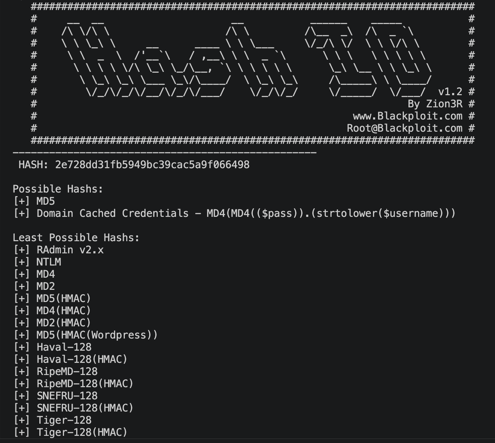

# This repo provides a layout for password hashing, hash identifying, and tools to decrypt hashes

## Symmetric Encryptions
Data Encryption Standard (DES): uses a 56-bit key. *deprecated*
Triple DES (3DES): 168-bit key. *deprecated*
Advanced Encryption Standard (AES): uses 128, 192, or 256-bit keys.

## Asymmetric Encryption
Rivest-Shamir-Adleman (RSA): uses 2048-bit or 3072-bit, relies on difficulty in factoring the product of two very large prime numbers.
Diffie-Hellman (DH): A = g^a mod p, B = g^b mod p, key = B^a mod p, key = A^b mod p. Allows secure key exchange without prior shared secrets.

### Encryption Tool
gpg --full-gen-key

#### Sample Hashing using Argon2
echo -n "Password" | argon2 "Random_Salt"

### hascat type list
https://hashcat.net/wiki/doku.php?id=example_hashes

### Online Rainbow Tables
https://hashes.com/en/decrypt/hash
https://crackstation.net/

## hash-id.py
hash-id.py is used to identify the hash type
e.g. python3 hash-id.py
hash: 2e728dd31fb5949bc39cac5a9f066498

## hashcat syntax
hashcat -m <hash-type> -a <attack-mode> hashfile wordlist
e.g. hascat -m 1000 -a 0 hash1.txt rockyou.txt

## john syntax
john --format=<encryption-type> --wordlist=<wordlist> hashfile
e.g. john --format=raw-md5 --wordlist=/rockyou.txt hash1.txt

